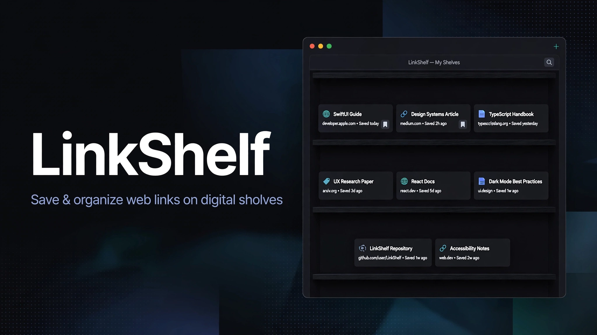

# LinkShelf

> ## Status: 🟡 In Progress
>
> <progress value="75" max="100"></progress>
> **Progress: 75%** — Core app and desktop widget fully implemented and verified end-to-end; search, drag & drop, and hover previews are still unimplemented and the CI UI tests fail.

<p align="center">
  
</p>


## What it is

LinkShelf is a native macOS workspace for saved web links — a personal link library with visual folders, page previews, and configurable desktop widgets. You save links (the toolbar `+` pre-fills from the clipboard), file them into folders, and browse them from the app or straight from a macOS desktop widget that can open sites, browse folders, and save the copied link with a tap. The app and the widget share one JSON file in Application Support through an App Group, so both always see the same shelf.

## What works (verified)

Verified by reading the source in `LinkShelf/` and `LinkShelfWidget/` (Swift can't be compiled in this Linux audit environment, so the build is marked accordingly below):

- ✅ **Save links with URL normalization** — `LibraryStore.addLink` normalizes schemeless input, refuses duplicates, and defaults the title to the host — verified in `Shared/LibraryStore.swift`.
- ✅ **Folders with badge counts, move/favorite/archive/trash/restore/delete** — implemented in `LibraryStore` and exercised in `LinkShelfUITests`.
- ✅ **Page titles and preview thumbnails** — fetched asynchronously per link (YouTube stills via oEmbed, other sites via `og:image`); thumbnails downsampled to 480px for the widget; metadata retries on launch for links missing it.
- ✅ **Sidebar navigation** — All Links, Favorites, Recent (last 20), Archive, Trash, plus per-folder views.
- ✅ **Grid/list layout preference** and **system/light/dark appearance** persisted across launches; ⌘1/⌘2 destination shortcuts.
- ✅ **Desktop widget (small/medium/large)** — per-widget shelf picker via App Intent (All Links, Favorites, or any folder); rows open the site in the browser; the `+` button opens a floating QuickAdd panel that saves the clipboard's link into that widget's shelf — verified in `LinkShelfWidget/LinkShelfWidget.swift` and `WidgetActions.swift`.
- ✅ **App Intent "New LinkShelf Folder"** for creating folders from Shortcuts or Spotlight without opening the window.
- ✅ **Unit tests** — 3 Swift Testing tests (navigation, invalid-preference fallback, preference round-trip) in `LinkShelfTests`.
- ✅ **XcodeGen project with zero third-party runtime dependencies** — `project.yml` generates the checked-in `.xcodeproj`.
- ✅ **CI workflow** — `.github/workflows/ci.yml` builds and tests the shared scheme with ad-hoc signing on macOS 15.

## Tech stack

| Layer | Choice |
|---|---|
| Language | Swift 6.2 |
| UI | SwiftUI, Observation framework |
| Desktop widget | WidgetKit (small / medium / large), AppIntents |
| Storage | Single JSON file in Application Support, shared via App Group `D676SQ267J.group.com.geltrax69.LinkShelf` |
| Project | XcodeGen (`project.yml`), checked-in `.xcodeproj` |
| Tests | Swift Testing (unit) + XCTest (UI scenarios) |
| CI | GitHub Actions on `macos-15` |

## How to run

Requires macOS 14+ and Xcode 16+ (developed with Xcode 26.3 / Swift 6.2.4). These are the documented in-repo steps — **they were not run here** (no Swift toolchain on this audit machine); verify on a Mac:

```sh
# Only needed when project.yml changes — the .xcodeproj is checked in.
xcodegen generate

# Build and run the unit + UI tests with ad-hoc signing.
xcodebuild -project LinkShelf.xcodeproj -scheme LinkShelf \
  -destination 'platform=macOS' \
  test CODE_SIGN_IDENTITY=- CODE_SIGN_STYLE=Manual
```

To make the widget register with the system, sign with a real identity and install into `/Applications` (ad-hoc signing is rejected by pluginkit):

```sh
./Scripts/install.sh   # signs with team D676SQ267J and installs to /Applications
```

Then place the widget manually: right-click the desktop ▸ **Edit Widgets** ▸ **LinkShelf** (automation can't cover that final drag).

> ⚠️ The `DEVELOPMENT_TEAM` (`D676SQ267J`) and App Group ID are hardcoded in `project.yml` and both entitlements files. Building on another machine needs its own team ID in those three places.

## Screenshots

All from the repo's `Docs/Screenshots` (native app shots):

| The library | Inside a folder |
| --- | --- |
|  |  |

| Widget: a shelf | Widget: browsing folders |
| --- | --- |
|  |  |

More exist in `Docs/Screenshots/`: `Library-light.png`, `Library-dark.png`, `Library-compact.png`, `Settings-dark.png`.

## What you can add more

- [ ] **Search across links and folders** — planned deterministic search (M9); the biggest missing navigation feature.
- [ ] **Drag and drop between folders + custom sorting** (M8).
- [ ] **Cancellable hover previews** of link pages (M7).
- [ ] **Menu bar presence and more keyboard shortcuts** (M11).
- [ ] **Fix the failing CI UI tests** — GitHub Actions failed on 2026-09-06: duplicate accessibility identifiers for the `addLink` and `buildInformation` buttons, and a window-size assertion in the appearance screenshot test. The unit tests and build itself pass.
- [ ] **Per-machine signing configuration** — move the team ID and App Group ID out of the checked-in files so others can build and install.
- [ ] **Accessibility and polish pass** — VoiceOver, increased contrast, multiple displays, and the macOS 14 runtime are still unverified (M12).
- [ ] **Beta packaging and release docs** (M14).

## Project structure

```
LinkShelf/
├── LinkShelf/                  # Main app
│   ├── App/                    # LinkShelfApp, RootView, toolbar, QuickAdd panel
│   ├── Features/Library/       # Destinations, empty states
│   ├── Features/Settings/      # Appearance + layout preferences
│   ├── Shared/                 # LibraryStore, Library model, metadata fetch
│   ├── DesignSystem/           # AppMetrics
│   └── Resources/              # Entitlements
├── LinkShelfWidget/            # WidgetKit extension + App Intents (browse, open, add)
├── LinkShelfTests/             # Swift Testing unit tests
├── LinkShelfUITests/           # XCTest UI scenarios
├── Docs/                       # architecture.md, testing.md, Screenshots/, banner
├── Scripts/install.sh          # Sign + install so the widget registers
├── project.yml                 # XcodeGen spec
├── LinkShelf.xcodeproj         # Checked-in generated project
├── DESIGN.md / PRODUCT.md      # Product blueprint
├── PROJECT_TRACKER.md          # Milestones, test status, known bugs
└── DECISIONS.md / CHANGELOG.md # Recorded decisions and history
```

---
*README written after code audit on 2026-10-08. Swift could not be compiled here — build steps are the documented ones, unverified on this machine.*
