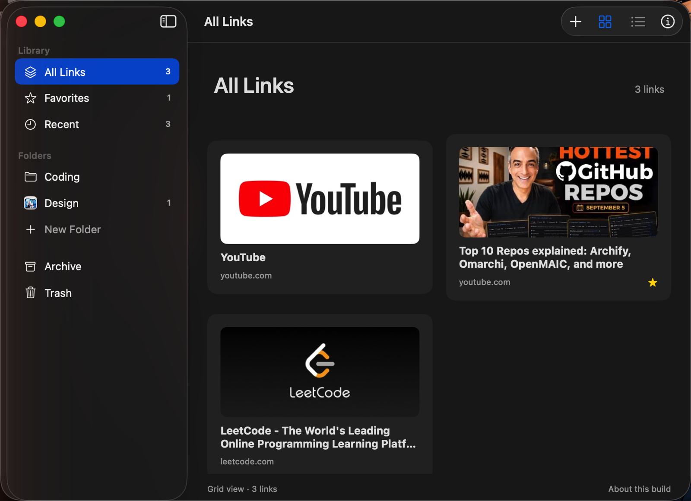
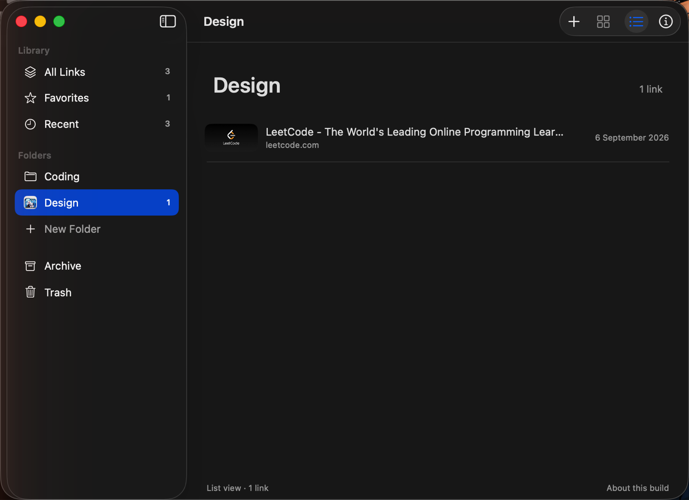
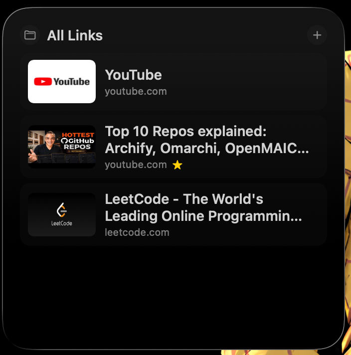
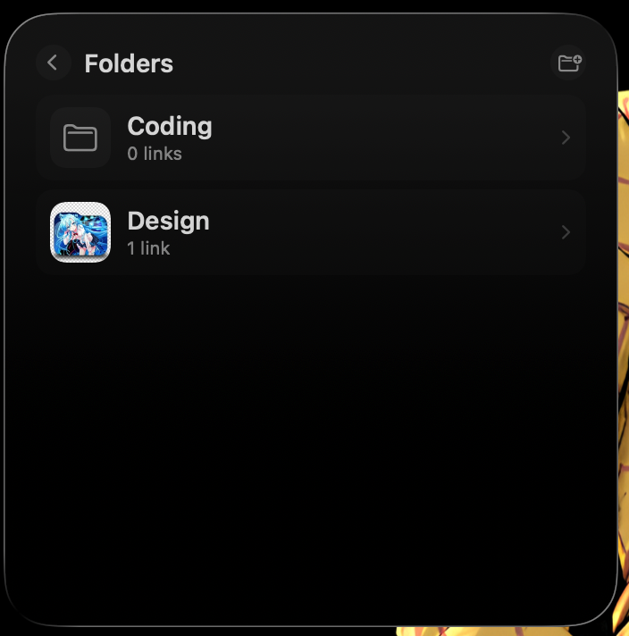

# LinkShelf

A native macOS workspace for saved links: visual folders, page previews, and configurable desktop widgets.

| The library | Inside a folder |
| --- | --- |
|  |  |

| Widget: a shelf | Widget: browsing folders |
| --- | --- |
|  |  |

The widget is interactive: **+** opens a small box to save the copied link, a row opens the site in your browser, the folder button browses your folders, and each folder opens to show what is inside.

Requires macOS 14+, Xcode 16+ (Swift Testing), and XcodeGen only when regenerating the project. Developed with Xcode 26.3 / Swift 6.2.4.

## Development

Open `LinkShelf.xcodeproj`, select the **LinkShelf** scheme, and run on **My Mac**. The checked-in project needs no third-party runtime dependencies.

```sh
xcodegen generate
xcodebuild -project LinkShelf.xcodeproj -scheme LinkShelf -destination 'platform=macOS' -derivedDataPath build/SignedDerivedData build CODE_SIGN_IDENTITY=- CODE_SIGN_STYLE=Manual
xcodebuild -project LinkShelf.xcodeproj -scheme LinkShelf -destination 'platform=macOS' -derivedDataPath build/SignedDerivedData test CODE_SIGN_IDENTITY=- CODE_SIGN_STYLE=Manual
```

## Using it

Add a link with the toolbar **+** (it pre-fills from the clipboard) or **Edit ▸ Paste Link** (⇧⌘V). Create folders in the sidebar, then right-click any link to favorite it, move it to a folder, archive, or trash it. Double-click opens it in your browser.

The library lives in `~/Library/Application Support/LinkShelf/library.json`, which the widget extension reads directly.

## Widgets

```sh
./Scripts/install.sh
```

That builds, copies `LinkShelf.app` to `/Applications` and registers it, which is what makes the widget appear. Then right-click the desktop (or open Notification Center) ▸ **Edit Widgets** ▸ **LinkShelf**, place it, and click the widget's **Edit Widget** to choose which shelf it shows.

The app is unsandboxed and uses a plain Application Support file rather than an App Group, because App Group entitlements need a provisioning profile. Switch both targets to a sandboxed App Group container before distributing.

See [PROJECT_TRACKER.md](PROJECT_TRACKER.md) for verified progress and [the blueprint](LinkShelf_macOS_Project_Blueprint.md) for the complete specification.

Local ad-hoc signing (`-`) requires no developer team. Keep signing enabled for UI tests: this Mac kills the unsigned UI runner before it can connect. For a single destination on Apple Silicon, use `platform=macOS,arch=arm64`.

Before every coding session, read the tracker and decisions, inspect Git status and recent commits, and run the relevant health check.
